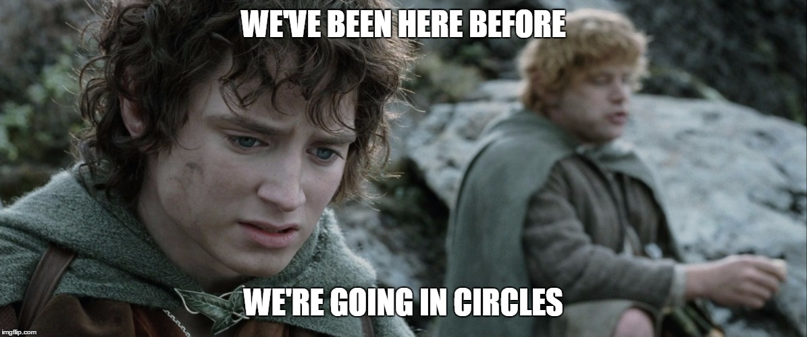
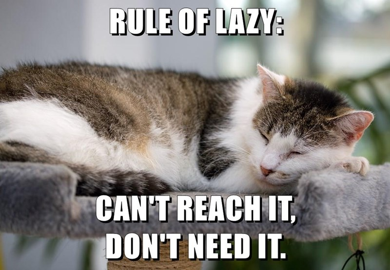
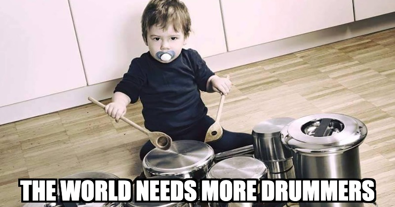

## Améliorer son jeu au quotidien ?
Ça tourne en rond,

à force de frotter votre manche, vous vous demandez si vous n'avez pas atteint une forme de stérilité acoustique.
Peut être que vous n'avez pas la bonne approche.

## Jouer en Jam !

Évidement, on a tous notre instinct de taupe qui nous dis qu'on peut creuser notre trou tous seul.

En plus c'est une perte de temps.
Les gens, l'organisation, les déplacements, les gens... alors qu'on peut utiliser ce temps pour s'entraîner plus longtemps !
Regarder des tutoriels et des cours...
Oui oui...

C'est des conneries, allez jouer avec des gens.
La mise en situation vaut tout les tuto du monde.

La question n'est pas de savoir ce que les gens ou les jams ont à vous apprendre.
Mais est-ce que vous être sûr d'avoir vraiment cerné les points que vous avez à travailler ?

En plus pourquoi croyez vous que les gens sont prêt à payer un abonnement à la salle alors qu'ils pourraient très bien faire ça seul ?
Parce qu'ils sont lucide et auront de beaux mollet cet été.

## Sa guitare à porté de bras 

C'est assez simple, si votre est guitare est dans une housse rangé dans votre placard.
C'est virtuellement la même chose que si elle était dans un garage sous clée à new york.
Techniquement vous pouvez en jouer, dans les fait vous pouvez d'ore et déjà la considérer comme une relique vintage.

Un instrument c'est à porté de bras et de regard.
Exit les grosses sessions d'entrainement du dimanche matin.
C'est quelque minutes volée par ci par là pendant votre pauses café qui feront vos progrès.

Si il vous faut plus de 30s pour commencer à jouer,
il vous faudra sûrement le même temps en année pour espérer progresser ;)

## Apprécier ou comprendre ? Les deux !

Vous savez quel est la différence entre un publique entouhsiate et un passioné ?
Leur façon de voir ce qu'ils ont devant eux.
Ne pas vous arretez pas au "c'est joli", prenez le reflexe de vous arrêter dès que vous entendez ou voyez quelque chose qui échappe à vos connaissance.

Sans forcément toujours réussir à le reproduire, ce n'est pas parfois pas possible.
Mais comprendre les coulisses fait partie de n'importe quel apprentissage.

## Poum tchac

Le soucis de la grande majorité des guitariste est la rythmique.
Pas simplement la justesse rytmique, mais la complexité et la compréhension.

Apprendre à jouer de nouvelle gamme de plus en plus vite, c'est bien.
Mais ça ne rend pas vos 4 temps plus groovy.

La base de la musique sera toujours là rythmique.

Faites des beats, jouez moins de notes, apprenez à clapper des rythmique spécifiques, prenez des cours avec un batteur.

## Faire une pause 

Parfois, rien n'y fait.
Tout les guitaristes connaissaient ca.

Peut être que que c'est simplement un manque de matière.
La musique reste de l'expression, si vous tournez en rond dans votre musique, c'est peut être que vous tournez en rond dans votre vie.

 Euh... merci pour la dépression... 

Non, justement, peut être qu'il faut juste ne pas essayer à tout prix à écrire une nouvelle histoire lorsque vous n'avez dans le fond rien de nouveau à dire.
Posez votre guitare quelque temps et faites d'autre choses, l'art nourrit l'art.
Cuisinez, faites du dessins, de la photo.
Ou simplement vivez de nouvelles choses, écoutez de nouveau sons, voyagez...

